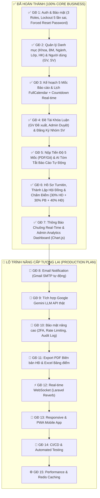

# 🎓 HỆ THỐNG QUẢN LÝ CÔNG TÁC KHÓA LUẬN TỐT NGHIỆP (HUIT)

> **Trường Đại Học Công Thương TP. Hồ Chí Minh (HUIT)**  
> **Phiên bản**: 2.0 (Chuẩn CSDL 31 bảng Khóa Luận Tốt Nghiệp)  
> **Tech Stack**: Laravel 11.x | PHP 8.2+ | MySQL (31 Tables) | Bootstrap 5 | Chart.js | FullCalendar v6

---

## 📌 TỔNG QUAN HỆ THỐNG

Hệ thống Quản lý Công tác Khóa luận Tốt nghiệp HUIT là giải pháp toàn diện trực tuyến dành cho 3 nhóm người dùng:
1. **Giáo vụ Khoa (Admin)**: Quản lý danh mục, lập kế hoạch mốc báo cáo, duyệt đề tài, phê duyệt đơn đăng ký, thành lập Hội đồng bảo vệ & phân công Giảng viên phản biện, xem Dashboard thống kê trực quan.
2. **Giảng viên (Lecturer)**: Đề xuất đề tài, theo dõi tiến độ báo cáo 5 mốc của các nhóm hướng dẫn, xem Tóm tắt AI tự động, đánh giá mốc, và nhập phiếu chấm điểm Hội đồng.
3. **Sinh viên (Student)**: Khởi tạo nhóm (2-3 SV), gửi lời mời thành viên, đăng ký đề tài, nộp báo cáo 5 mốc (PDF/Git link), xem Tóm tắt AI, nộp hồ sơ bảo vệ Turnitin và tra cứu bảng điểm tổng kết kèm xếp loại tốt nghiệp.

---

## 📊 LỘ TRÌNH 15 GIAI ĐOẠN (7 COMPLETED + 8 PRODUCTION PLAN)



---

## 📋 CHI TIẾT CÁC GIAI ĐOẠN ĐÃ HOÀN THÀNH (GĐ 1 — GĐ 7)

### ✅ GIAI ĐOẠN 1: AUTHENTICATION & BẢO MẬT
- Đăng nhập 3 vai trò: Giáo vụ (`VT01`), Giảng viên (`VT02`), Sinh viên (`VT03`).
- Tự động khóa tài khoản sau **5 lần nhập sai mật khẩu** liên tiếp (`TrangThai = false`).
- Alert đỏ nổi bật cảnh báo khi tài khoản bị khóa.
- Ép buộc đổi mật khẩu (`BatBuocDoiMatKhau = true`) đối với tài khoản cấp mới/reset.

### ✅ GIAI ĐOẠN 2: QUẢN LÝ DANH MỤC & NGƯỜI DÙNG (GIÁO VỤ KHOA)
- CRUD Khoa (`KhoaController`), Bộ môn (`BoMonController`), Ngành (`NganhController`), Lớp (`LopController`), Học kỳ (`HocKyController`).
- CRUD Giảng viên (`GiangVienController`), Sinh viên (`SinhVienController`).
- Duyệt yêu cầu reset mật khẩu (`YeuCauDoiMatKhauController`).

### ✅ GIAI ĐOẠN 3: KẾ HOẠCH 5 MỐC BÁO CÁO & LỊCH CALENDAR
- Lập kế hoạch khóa luận theo 5 mốc trình tự cố định.
- Giao diện **FullCalendar v6** tương tác kèm đồng hồ đếm ngược (**Countdown Timer**) thời gian thực cho cả 3 vai trò (`/admin/calendar`, `/giangvien/calendar`, `/sinhvien/calendar`).

### ✅ GIAI ĐOẠN 4: QUẢN LÝ ĐỀ TÀI & ĐĂNG KÝ NHÓM
- Giảng viên đề xuất đề tài $\rightarrow$ Giáo vụ phê duyệt đề tài (`/admin/duyet-detai`).
- Sinh viên lập nhóm (2-3 người), gửi lời mời bạn học $\rightarrow$ Đăng ký đề tài đã duyệt $\rightarrow$ Giáo vụ phê duyệt đơn đăng ký (`/admin/duyet-dangky-detai`).

### ✅ GIAI ĐOẠN 5: NỘP BÀI TIẾN ĐỘ 5 MỐC & AI TÓM TẮT BÁO CÁO
- Sinh viên nộp bài theo 5 mốc (Mốc 1-3: PDF; Mốc 4: Git; Mốc 5: PDF + Git).
- Tự động mở khóa mốc tiếp theo khi mốc trước được đánh giá **"Đạt"**.
- Dịch vụ **`AiSummaryService`**: Tự động phân tích & trích xuất tóm tắt báo cáo (*Công việc đã hoàn thành, Khó khăn gặp phải, Kế hoạch tuần tới*).
- Giảng viên xem tóm tắt AI và đánh giá Đạt / Yêu cầu nộp lại (`/giangvien/baocao`).

### ✅ GIAI ĐOẠN 6: HỒ SƠ TURNITIN, HỘI ĐỒNG BẢO VỆ & CHẤM ĐIỂM
- Nhóm hoàn thành Mốc 5 $\rightarrow$ Được nộp Hồ sơ Bảo vệ (`/sinhvien/ho-so-bao-ve`) kèm tỷ lệ trùng lặp Turnitin (%) + PDF minh chứng.
- Giáo vụ duyệt hồ sơ, thành lập Hội đồng bảo vệ (`/admin/hoi-dong`) và phân công Giảng viên phản biện.
- Giảng viên chấm điểm bảo vệ từng sinh viên (`/giangvien/chamdiem`).
- **Công thức tính điểm tự động**:
  $$\text{Điểm Tổng Kết} = (D_{\text{GVHD}} \times 30\%) + (D_{\text{GVPB}} \times 30\%) + (D_{\text{HĐTB}} \times 40\%)$$
- **Tự động xếp loại**: Xuất sắc ($\ge 9.0$), Giỏi ($\ge 8.0$), Khá ($\ge 7.0$), Trung bình ($\ge 6.0$), Không đạt ($< 5.0$).
- Sinh viên tra cứu bảng điểm visual kèm progress bar tỷ trọng điểm thành phần (`/sinhvien/ket-qua`).

### ✅ GIAI ĐOẠN 7: THÔNG BÁO CHUÔNG REAL-TIME & ANALYTICS DASHBOARD
- **`ThongBaoService`**: Gửi thông báo tự động đến cá nhân, nhóm SV, GVHD hoặc toàn khoa.
- **Notification Bell Dropdown**: Đặt trên Topbar Header của cả 3 layout, hiển thị badge chưa đọc & 6 thông báo mới nhất.
- **Admin Analytics Dashboard (`/admin`)**: 6 Card chỉ số + 2 Biểu đồ **Chart.js** tương tác (Doughnut Chart xếp loại SV, Bar Chart tiến độ mốc báo cáo).

---

## 🚀 KẾ HOẠCH BỔ SUNG & NÂNG CẤP TƯƠNG LAI (GĐ 8 — GĐ 15)

| Giai Đoạn | Tên Tính Năng | Mục Tiêu & Mô Tả Kỹ Thuật | Ưu Tiên |
|-----------|---------------|----------------------------|---------|
| **GĐ 8** | 📧 Email Notification (Gmail SMTP) | Gửi mail tự động khi duyệt đề tài, nộp báo cáo, có nhận xét mới, phân công Hội đồng. Sử dụng Laravel Mail + Queue background job. | 🔴 Cao |
| **GĐ 9** | 🤖 Gemini LLM API Integration | Tích hợp Google Gemini 2.0 Flash API đọc file PDF thật, tóm tắt báo cáo & phát triển Chatbot AI hỗ trợ giải đáp quy chế khóa luận. | 🔴 Cao |
| **GĐ 10** | 🔐 Bảo Mật Nâng Cao (Production-Grade) | Bổ sung Rate Limiting API (60 req/min), XSS/CSP sanitization, Audit Activity Log (`spatie/laravel-activitylog`), và 2FA OTP qua Email. | 🔴 Cao |
| **GĐ 11** | 📄 Export PDF & Excel Reports | Nút bấm xuất Biên bản Hội đồng (PDF - `dompdf`) & Bảng điểm tổng hợp toàn khoa kèm xếp loại tốt nghiệp (Excel - `laravel-excel`). | 🟡 Trung bình |
| **GĐ 12** | ⚡ Real-time WebSocket (Laravel Reverb) | Tự động cập nhật chuông thông báo & trạng thái duyệt đề tài thời gian thực không cần F5 trình duyệt. | 🟡 Trung bình |
| **GĐ 13** | 📱 Responsive & PWA Mobile | Tối ưu UI/UX mobile/tablet và đóng gói Progressive Web App (PWA) để cài lên màn hình điện thoại như app native. | 🟡 Trung bình |
| **GĐ 14** | 🧪 Automated Testing & CI/CD | Viết Feature Test cho toàn bộ controllers & thiết lập GitHub Actions chạy test tự động khi push code. | 🟢 Thấp |
| **GĐ 15** | ⚙️ Performance Optimization & Redis | Áp dụng Redis Caching cho Dashboard, Eager Loading triệt tiêu N+1 queries, và nén tài nguyên static. | 🟢 Thấp |

---

## 🔑 TÀI KHOẢN ĐĂNG NHẬP TEST

| Vai trò | Tên đăng nhập | Mật khẩu | Ghi chú |
|---------|---------------|----------|---------|
| **Giáo vụ Khoa (Admin)** | `giaovu01` | `123456` | Quyền Quản trị viên |
| **Giảng viên** | `gv01` | `123456` | GV Hướng dẫn & Chủ tịch Hội đồng |
| **Giảng viên** | `gv02` / `gv03` | `123456` | Thư ký & GV Phản biện |
| **Sinh viên (Nhóm N01)** | `sv01` | `123456` | Trưởng nhóm N01 |
| **Sinh viên (Nhóm N01)** | `sv02` / `sv03` | `123456` | Thành viên nhóm N01 |
| **Sinh viên (Chưa nhóm)** | `sv04` / `sv05` / `sv06` | `123456` | Dùng để test tạo nhóm mới |

---

## ⚙️ HƯỚNG DẪN CÀI ĐẶT 1-CLICK

```bash
# 1. Clone repository
git clone https://github.com/ChjZung/Graduation-Thesis-Management-System.git
cd Graduation-Thesis-Management-System

# 2. Cài đặt Composer Dependencies
composer install

# 3. Tạo file cấu hình môi trường .env
cp .env.example .env
php artisan key:generate

# 4. Cấu hình CSDL trong file .env (MySQL/Laragon):
# DB_DATABASE=khoa_luan_tot_nghiep
# DB_USERNAME=root
# DB_PASSWORD=

# 5. Tạo liên kết lưu trữ storage & Nạp CSDL 31 bảng + dữ liệu mẫu:
php artisan storage:link
php artisan migrate:fresh --seed

# 6. Chạy ứng dụng:
php artisan serve
```
👉 **Truy cập web tại**: `http://127.0.0.1:8000`

---

## 🤖 CONTEXT DÀNH CHO AI ASSISTANT / DEVELOPERS TIẾP TỤC NÂNG CẤP

> **Dành cho các bạn clone dự án về để phát triển thêm hoặc đưa prompt cho AI:**

### 📐 1. Quy định Đặt tên & CSDL (CRITICAL)
- **Số bảng CSDL**: Giữ nguyên **chính xác 31 bảng** theo migration `2026_08_12_000001_create_khoa_luan_tot_nghiep_tables.php`. KHÔNG tạo thêm bảng mới ngoại trừ bảng hỗ trợ kỹ thuật (như `jobs`, `migrations`).
- **Mã số tự động**:
  - Đề tài: `DT01`, `DT02`...
  - Nhóm: `N01`, `N02`...
  - Báo cáo: `BC001`, `BC002`...
  - Hội đồng: `HD01`, `HD02`...
  - Yêu cầu reset mật khẩu: `YCMK_XXXXXX`

### 📁 2. Cấu trúc thư mục chính (Key Files)

```
app/
├── Http/Controllers/
│   ├── Admin/
│   │   ├── DashboardController.php        # Analytics & Chart.js
│   │   ├── DuyetDeTaiController.php       # Duyệt đề tài GV đề xuất
│   │   ├── DuyetDangKyDeTaiController.php # Duyệt đơn đăng ký của SV
│   │   ├── HoiDongController.php          # Thành lập HĐ & gán SV
│   │   └── HoSoBaoVeController.php        # Phân công GVPB & Turnitin
│   ├── GiangVien/
│   │   ├── DeTaiController.php            # CRUD đề tài
│   │   ├── DuyetBaoCaoController.php      # Đánh giá 5 mốc + AI summary
│   │   └── ChamDiemController.php         # Chấm điểm HĐ & tính điểm tổng kết
│   └── SinhVien/
│       ├── NhomController.php             # Tạo nhóm & mời bạn
│       ├── DangKyDeTaiController.php      # Đăng ký đề tài
│       ├── BaoCaoController.php           # Nộp mốc báo cáo 1-5
│       ├── HoSoBaoVeController.php        # Nộp hồ sơ Turnitin
│       └── KetQuaController.php           # Bảng điểm tổng kết & xếp loại
├── Models/
│   ├── TaiKhoan.php, SinhVien.php, GiangVien.php, Nhom.php, DeTai.php
│   ├── BaoCaoTienDo.php, TomTatBaoCao.php, NhanXet.php
│   ├── HoSoBaoVe.php, HoiDong.php, ThanhVienHoiDong.php, ChiTietDiemHoiDong.php, KetQuaSinhVien.php
│   └── NguoiNhanThongBao.php
└── Services/
    ├── AiSummaryService.php               # Tóm tắt AI báo cáo (rule-based / có thể thay bằng Gemini API)
    └── ThongBaoService.php                # Service phát thông báo
```

### 💡 3. Prompt mẫu để đưa cho AI (Ví dụ ChatGPT / Gemini / Claude / Cursor / Antigravity):

> *"Tôi đang phát triển dự án Laravel 11 Hệ thống Quản lý Khóa luận Tốt nghiệp HUIT (chuẩn 31 bảng CSDL). Dự án đã hoàn thành 7 giai đoạn cốt lõi và đang ở Giai đoạn [8-15]. Hãy đọc sơ đồ 15 Giai đoạn & cấu trúc dự án từ file README.md này, sau đó hỗ trợ tôi lập trình tiếp chức năng [Tên chức năng]..."*

---
*Đại học Công Thương TP. Hồ Chí Minh (HUIT) — Faculty of Information Technology*
