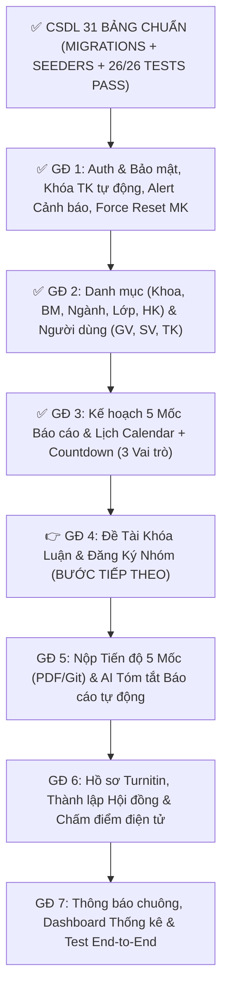

# HỆ THỐNG QUẢN LÝ CÔNG TÁC KHÓA LUẬN TỐT NGHIỆP (HUIT)

> **Trường Đại Học Công Thương TP. Hồ Chí Minh (HUIT)**  
> **Phiên bản Hệ thống**: 2.0 (Chuẩn CSDL 31 bảng Khóa Luận Tốt Nghiệp)  
> **Framework**: Laravel 11.x / PHP 8.2+

---

## 📌 TỔNG QUAN HỆ THỐNG

Hệ thống Quản lý Công tác Khóa luận Tốt nghiệp HUIT là nền tảng quản lý trực tuyến hỗ trợ 3 đối tượng người dùng chính: **Giáo vụ Khoa (Admin)**, **Giảng viên (Lecturer)**, và **Sinh viên (Student)**.

Hệ thống được thiết kế theo quy trình nộp báo cáo **5 Mốc trình tự cố định**, tích hợp **Dịch vụ AI Tóm tắt báo cáo tự động (AI Summary Service)**, **Giao diện Lịch Calendar tương tác kèm Đồng hồ đếm ngược (Countdown)**, và **Phiếu chấm điểm Hội đồng điện tử**.

---

## 📊 TIẾN ĐỘ THI CÔNG & LỘ TRÌNH 7 GIAI ĐOẠN



---

## 📋 CHI TIẾT TRẠNG THÁI CÁC GIAI ĐOẠN

### ✅ GIAI ĐOẠN 1: AUTHENTICATION, BẢO MẬT & MÀN HÌNH KHÓA TÀI KHOẢN
- [x] Đăng nhập phân luồng 3 vai trò: `Giáo vụ` (`VT01`), `Giảng viên` (`VT02`), `Sinh viên` (`VT03`).
- [x] Đếm 5 lần nhập sai mật khẩu liên tiếp $\rightarrow$ Tự động khóa tài khoản (`TrangThai = 0`, ghi `NgayKhoa`).
- [x] Màn hình Login xuất hiện **Alert đỏ pulse viền nổi bật** khi tài khoản bị khóa.
- [x] Cơ chế ép đổi mật khẩu (`BatBuocDoiMatKhau = true`) khi được Giáo vụ Reset mật khẩu.
- [x] Middleware `CheckRole` hỗ trợ vai trò Giáo vụ và Admin.

### ✅ GIAI ĐOẠN 2: QUẢN LÝ DANH MỤC & NGƯỜI DÙNG (GIÁO VỤ KHOA)
- [x] `KhoaController`: CRUD Khoa (`/admin/khoa`).
- [x] `BoMonController`: CRUD Bộ môn (`/admin/bomon`).
- [x] `NganhController`: CRUD Ngành học (`/admin/nganh`).
- [x] `LopController`: CRUD Lớp hành chính (`/admin/lop`).
- [x] `HocKyController`: CRUD Học kỳ (`/admin/hocky`).
- [x] `GiangVienController`: CRUD Giảng viên, tự sinh mã `TK_GV_xxxxxx` (Role `VT02`).
- [x] `SinhVienController`: CRUD Sinh viên, tự sinh mã `TK_SV_xxxxxx` (Role `VT03`).
- [x] `YeuCauDoiMatKhauController`: Duyệt yêu cầu reset mật khẩu.

### ✅ GIAI ĐOẠN 3: KẾ HOẠCH KHÓA LUẬN, 5 MỐC THỜI GIAN & LỊCH CALENDAR
- [x] `KeHoachKhoaLuanController`: Lập kế hoạch khóa luận học kỳ (`/admin/kehoach`).
- [x] Cấu hình **5 Mốc thời gian trình tự cố định**:
  1. *Mốc 1: Phân tích Nghiệp vụ* (Nộp File PDF)
  2. *Mốc 2: Phân tích Hệ thống* (Nộp File PDF)
  3. *Mốc 3: Thiết kế CSDL* (Nộp File PDF)
  4. *Mốc 4: Triển khai Code & Demo* (Nộp Link Source Git GitHub/GitLab)
  5. *Mốc 5: Báo cáo Hoàn thành & Bổ sung* (Nộp PDF + Link Git)
- [x] `CalendarController`: **FullCalendar v6 View & Countdown Timer** thời gian thực (Ngày : Giờ : Phút : Giây) cho cả 3 vai trò:
  - Giáo vụ Khoa: `/admin/calendar`
  - Giảng viên: `/giangvien/calendar`
  - Sinh viên: `/sinhvien/calendar`

### 🔄 GIAI ĐOẠN 4 (TIẾP THEO): ĐỀ TÀI KHÓA LUẬN & ĐĂNG KÝ NHÓM
- Giảng viên đề xuất đề tài mới $\rightarrow$ Giáo vụ duyệt đề tài.
- Sinh viên lập nhóm 3 người $\rightarrow$ Đăng ký đề tài đã công bố $\rightarrow$ Giáo vụ phê duyệt.

---

## 🔑 TÀI KHOẢN ĐĂNG NHẬP THỬ NGHIỆM

- **Giáo vụ Khoa (Admin)**: `giaovu01` | Mật khẩu: `123456`
- **Giảng viên**: `gv01` | Mật khẩu: `123456`
- **Sinh viên**: `sv01` | Mật khẩu: `123456`

---

## ⚙️ HƯỚNG DẪN CÀI ĐẶT TRÊN THIẾT BỊ MỚI

1. **Clone repository**:
   ```bash
   git clone https://github.com/ChjZung/Graduation-Thesis-Management-System.git
   cd Graduation-Thesis-Management-System
   ```

2. **Cài đặt dependencies & file `.env`**:
   ```bash
   composer install
   cp .env.example .env
   php artisan key:generate
   ```

3. **Cấu hình Database & Nạp 31 bảng CSDL**:
   - Mở `.env` và chỉnh tên Database: `DB_DATABASE=quanly_doan`
   - Chạy lệnh khởi tạo CSDL & dữ liệu mẫu:
     ```bash
     php artisan migrate:fresh --seed
     ```

4. **Chạy ứng dụng**:
   ```bash
   php artisan serve
   ```
   TRUY CẬP: `http://127.0.0.1:8000`
